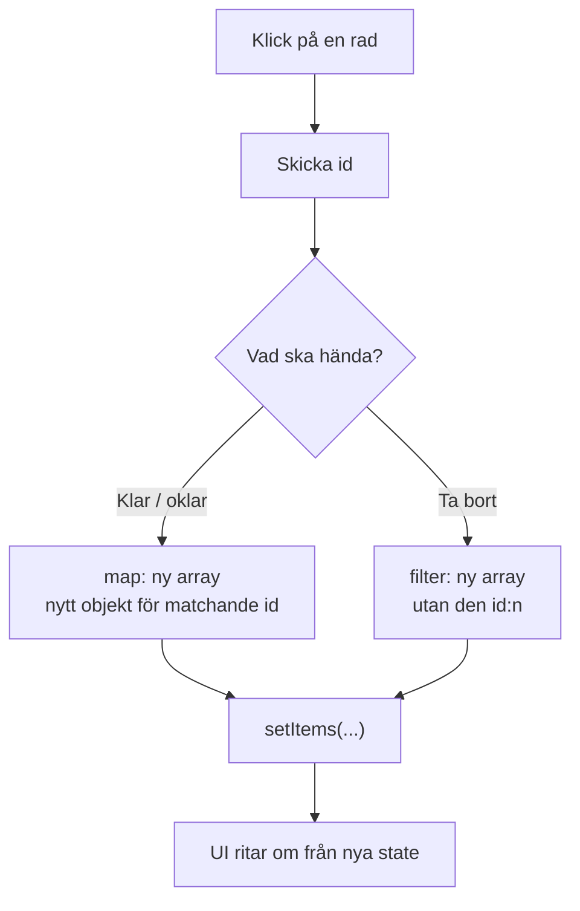
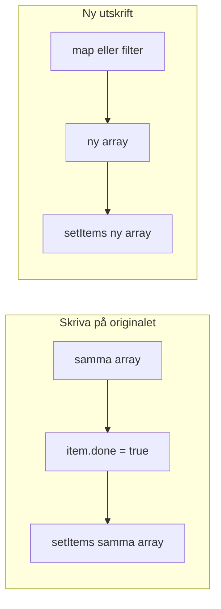

# 02 — Visuellt: Ny lista, inte sudd på originalet

Samma utskrifts-metafor som i teoriguiden — nu som flöde. Ingen layoutkarta i det här paketet: toggle och delete räcker att se.

GitHub renderar diagrammen nedan automatiskt.

---

## Två jobb, två verktyg



**Vad diagrammet visar:** Klicket är inte bytet. Bytet är `setItems`. Map och filter är *hur* nästa utskrift ser ut.  
**Kom ihåg / INTE:** Map ≠ ta bort. Filter ≠ toggle. Båda ger en **ny** array.

---

## Mutation vs ny utskrift



Till vänster: du suddar på enda pappret. React kan missa att något ändrats.  
Till höger: du lämnar in ett nytt papper. Det är bytet du ska **peka på** muntligt.

**Målsvar (säg högt / skriv i README):** *“State uppdateras i setItems. Jag pekar på den raden och säger om det var map (toggle) eller filter (delete).”*

---

## En rad i högen

```text
Före:  [{id:1,...}, {id:2, done:false}, {id:3,...}]
Toggle 2: samma tre rader, men id 2 har done:true — ny array, nytt objekt för 2
Delete 2: två rader kvar (1 och 3) — ny, kortare array
```

**Kom ihåg:** `id` följer raden. Index 1 är inte en identitet — den flyttar sig när du tar bort.

---

## Checkpoint (privat)

Utan att titta på teoriguiden: säg kedjan högt (id → map eller filter → setItems → UI) och var du pekar när någon frågar “var uppdateras state?”. Jämför sen med diagrammen.

När kartan sitter: [03 — Övningar](./03-ovningar.md).
