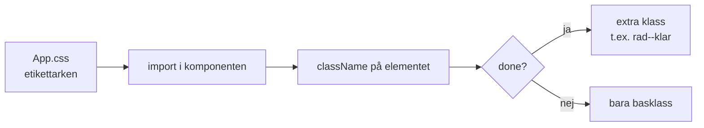
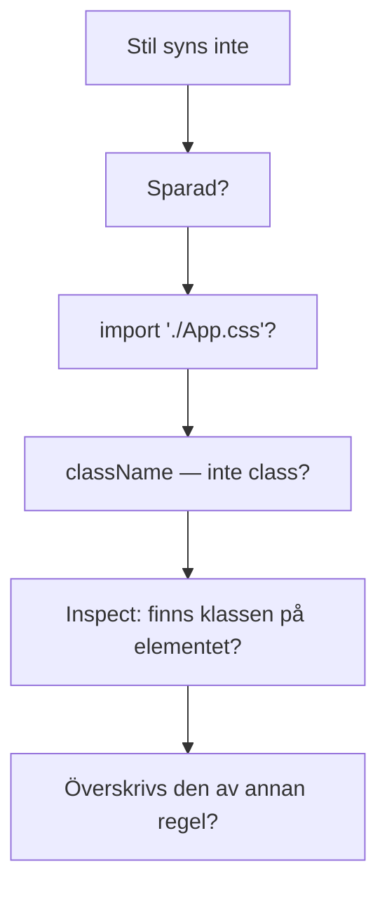

# 02 — Visuellt: Etikett och överstruken rad

Samma burk- och anteckningsboks-metafor som i teoriguiden — nu som flöde. Ingen Grid-karta: import, klass och klar-stil räcker att se.

GitHub renderar diagrammen nedan automatiskt.

---

## Från fil till öga



**Vad diagrammet visar:** Utan import kommer arket aldrig fram. Utan `className` sitter inte etiketten på burken.  
**Kom ihåg / INTE:** `class=` i JSX är fel namn. `done` i state är inte samma sak som genomstruken text.

---

## Två lager

```text
Data:    { id: 2, text: "Basilika", done: true }   ← innehållet i burken
Etikett: className="rad rad--klar"                 ← lappen du ser
Öga:     Basilika  (överstruken, lite blek)        ← strecket i anteckningsboken
```

Utan etikett kan innehållet vara rätt — du öppnar fel burk.  
Utan data kan du styla “på måfå” och ljuga för ögat.

**Målsvar (säg högt / skriv i README):** *“Jag importerar CSS-filen, sätter className, och ger klara rader en extra klass så skillnaden syns.”*

---

## Debug-kedjan



Stanna vid första nej. Byt inte slumpmässiga pixlar.

---

## Checkpoint (privat)

Utan att titta på teoriguiden: säg import → `className` → extra klass vid `done` → Inspect om det strular. Jämför sen med diagrammen.

När kartan sitter: [03 — Övningar](./03-ovningar.md).
