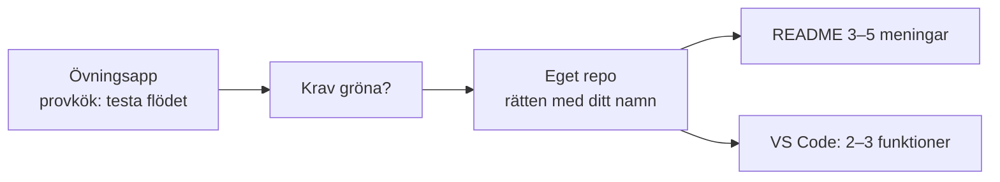
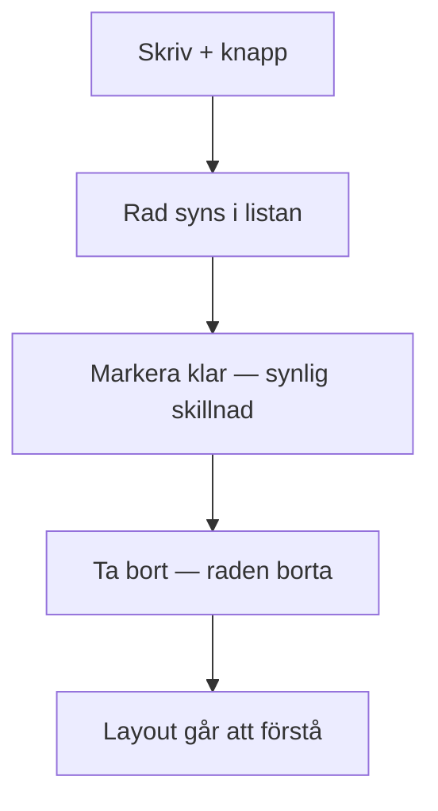

# 02 — Visuellt: Från provkök till namnbricka

Samma provköks-metafor som i teoriguiden — nu som karta. Inga nya API-diagram: krav, feedback och eget repo räcker att se.

GitHub renderar diagrammen nedan automatiskt.

---

## Två kök



**Vad diagrammet visar:** Övningen är inte inlämningen. Du smakar av först, sen bygger du där examinationen tittar.  
**Kom ihåg / INTE:** Nytt React-API behövs inte. Namnbrickan är README + att du kan peka.

---

## Krav som kedja du kan klicka



En röd länk = inte G än. Testa i **övningsappen** innan du skyller på “exam-stress”.

**Målsvar (säg högt / skriv i README):** *“Jag kan köra lägg till → visa → klar → ta bort i övningsappen innan jag bygger om det i mitt exam-repo.”*

---

## AI-utkast in i din kod

```text
AI-snutt
  → Vad ska den göra?
  → Kan jag förklara varje del?
  → FEEDBACK: konkret rad → konkret ändring
  → Först då: in i MIN app
```

Till vänster utan steg 3: du äger inte koden. Till höger: du har en mening att sätta i README senare.

---

## Checkpoint (privat)

Utan att titta: räkna upp fem funktionskrav + var muntan sker (VS Code) + varför övningsmappen inte är inlämningen. Jämför sen med diagrammen.

När kartan sitter: [03 — Övningar](./03-ovningar.md).
